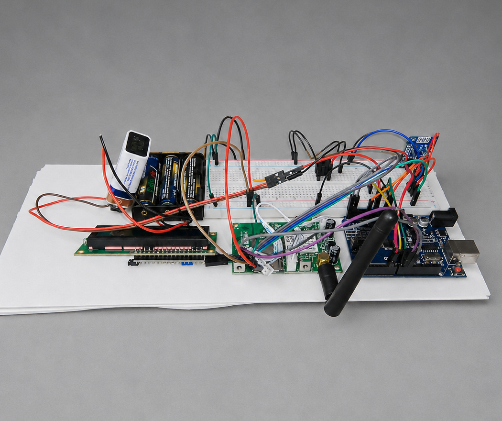
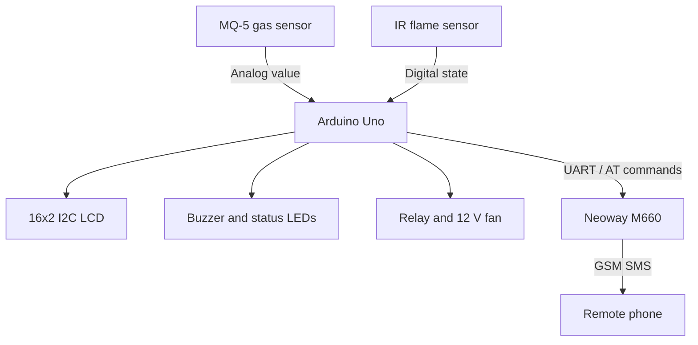
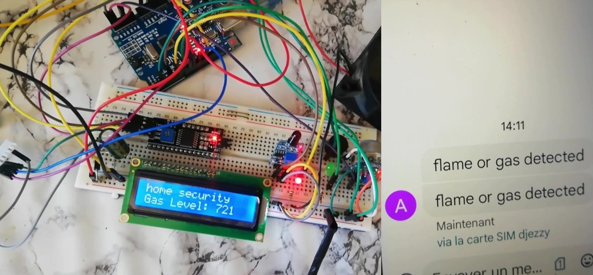

# Arduino GSM Gas and Flame Alarm

Embedded safety-monitoring prototype built around an Arduino Uno, an MQ-5 combustible-gas sensor, a digital IR flame sensor, local alarm outputs, relay-controlled ventilation, and GSM/SMS notification.

> **Portfolio context:** team engineering project, completed in June 2022. This repository documents the verified implementation and provides carefully reconstructed firmware because the original source file was lost.



## Project purpose

The prototype monitors combustible-gas concentration and flame presence inside a domestic environment. When a hazard is detected, the Arduino performs local protection immediately and requests a remote SMS notification through the GSM modem.

The local alarm path remains independent of successful cellular delivery: the buzzer, status LEDs, and ventilation relay are controlled directly by the microcontroller.

## Implemented system

- Continuous analog acquisition from an MQ-5 gas-sensor module
- Digital flame-state monitoring
- Live raw gas value on a 16x2 I2C LCD
- Red/green visual status and audible buzzer alarm
- Relay control of a 12 V ventilation fan
- Neoway M660 GSM/GPRS modem controlled with UART AT commands
- SMS transmission when the alarm condition is reached
- Separate 5 V electronics and 12 V fan power domains

## Architecture



The Arduino owns the deterministic sensing and alarm response. GSM communication is a parallel notification channel rather than a prerequisite for local protection.

## Physical validation



The supplied demonstration video verifies:

| Check | Observed result |
| --- | --- |
| Ambient gas reading | Approximately 15-26 raw ADC counts |
| Controlled lighter-gas exposure | Displayed value increased to 721 |
| Local response | Alarm indication and fan operation demonstrated |
| Remote response | Phone received `flame or gas detected` by SMS |

The displayed values were not calibrated as ppm. The video also does not isolate a separate flame-only validation sequence.

## Repository structure

```text
.
|-- assets/                         Portfolio and validation images
|-- docs/
|   |-- architecture.md             Signal, control, and power architecture
|   |-- hardware-and-wiring.md      Hardware inventory and reconstructed pins
|   |-- validation.md               Evidence, limitations, and test guidance
|   `-- portfolio/                  PDF portfolio section and Overleaf source
|-- firmware/
|   `-- gsm_gas_flame_alarm/
|       `-- gsm_gas_flame_alarm.ino Reconstructed Arduino firmware
`-- README.md
```

## Firmware highlights

The reconstructed firmware adds several protections that are appropriate for a maintainable prototype:

- Averaged gas readings
- Separate alarm-on and alarm-off thresholds for hysteresis
- Multi-sample flame confirmation
- Local alarm operation even when GSM is unavailable
- GSM response checking, retry control, and one notification per alarm event
- Sensor warm-up handling
- Explicit configuration for relay and flame-sensor active levels

See [firmware setup](firmware/README.md) before uploading it to hardware.

## Important limitations

- The firmware is reconstructed from the available video and observed wiring; it is not the lost original source.
- The MQ-5 alarm thresholds are placeholders and must be calibrated for the target gas, enclosure, airflow, temperature, and humidity.
- Pin assignments, LCD address, GSM baud rate, logic-level compatibility, and relay polarity must be confirmed on the physical prototype.
- The MQ-5 is a combustible-gas sensor. This implementation should not be described as a certified smoke detector.
- This prototype is not certified life-safety equipment and must not replace an approved fire or gas alarm.

## Proposed architecture evolution - not implemented

- Calibrated, target-selective gas sensing with environmental compensation and sensor-fault diagnostics
- A dedicated certified smoke-sensing channel where the application requires smoke detection
- LTE-M or NB-IoT connectivity with authenticated MQTT/TLS telemetry, while retaining SMS as a fallback
- Watchdog supervision, battery backup, self-test, and network-health monitoring

## Portfolio

The recruiter-facing one-page case study is available in [`docs/portfolio`](docs/portfolio/). It follows the visual identity of the ADIUTOR portfolio while keeping this project correctly positioned as an additional project.

## Author

**Tinhinene Boumerdassi**  
Embedded Systems & Electronics Engineer  
[Portfolio](https://tina-boumerdassi-portfolio.framer.website/) | [GitHub](https://github.com/tinaboum)

