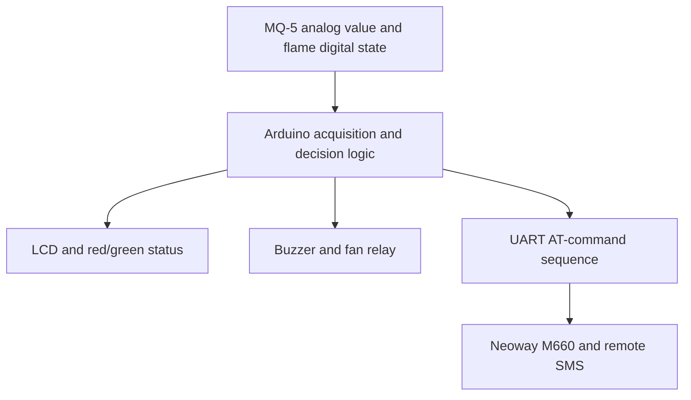
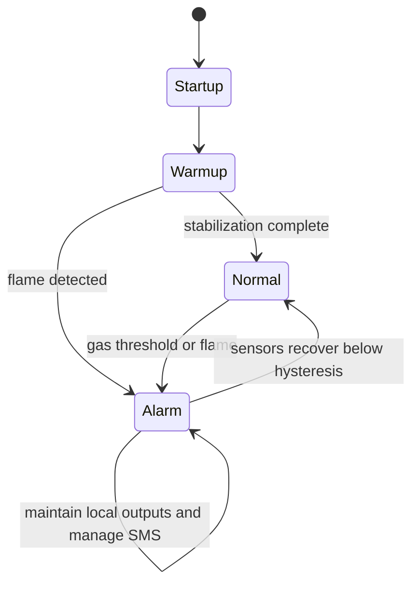

# System architecture

## Signal and response flow

## Deterministic functions

The following functions belong on the microcontroller and must not depend on cellular or cloud availability:

- Sensor acquisition
- Alarm-threshold evaluation
- Buzzer and indicator control
- Fan-relay control
- Fault-safe output defaults

## Communication function

The GSM modem receives AT commands through a software UART. When an alarm event begins, the controller requests a text-mode SMS. Communication failure does not deactivate the local alarm or ventilation outputs.

## Reconstructed firmware state flow

## Power architecture

| Domain | Loads | Engineering reason |
| --- | --- | --- |
| 5 V electronics | Arduino, sensors, LCD, interface electronics | Logic and sensing supply |
| GSM supply path | Neoway carrier/module | Must support modem current transients |
| 12 V actuator | DC ventilation fan | Keeps the motor load outside the logic rail |

The exact regulator and carrier-board implementation must be verified before rebuilding the prototype.

